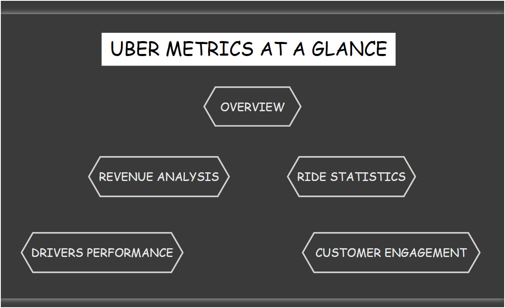
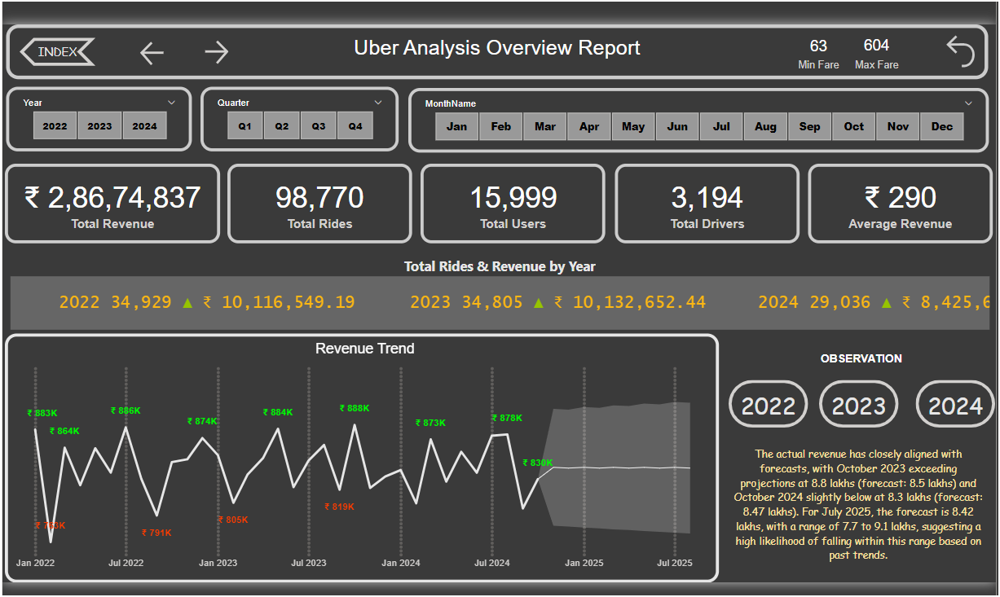
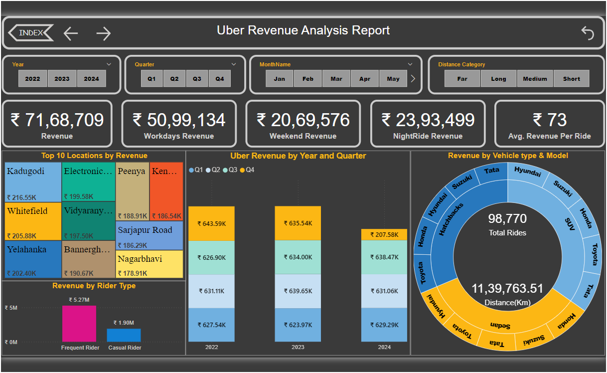
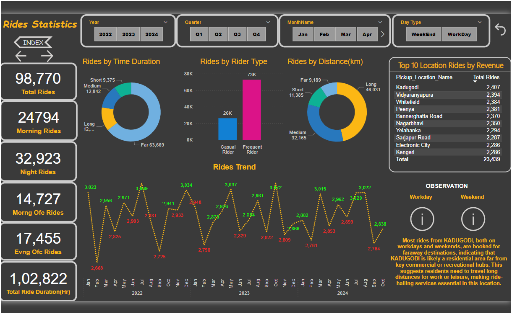
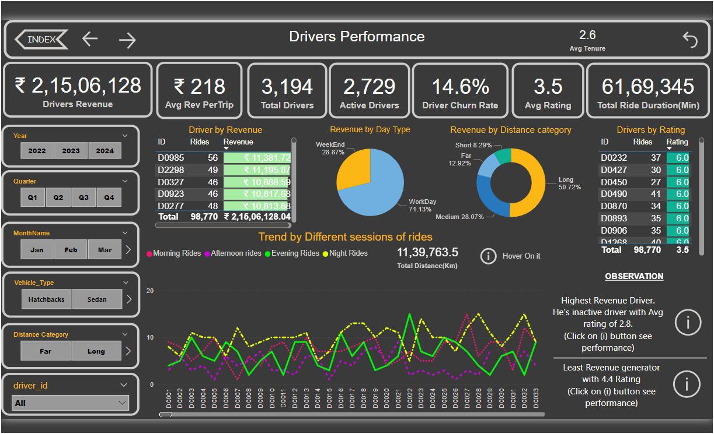
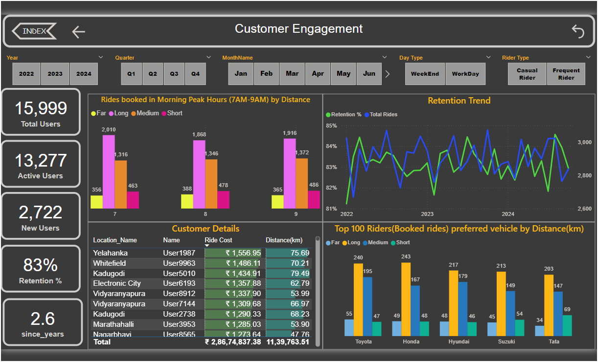

# Uber Metrics at a Glance
## Overview
This project analyzes Uber's key performance metrics using Microsoft Fabric and Power BI. The goal is to provide insights into Uber's operational performance, focusing on ride statistics, revenue trends, and driver engagement. The project integrates data from various sources, cleanses and transforms it in Microsoft Fabric, and visualizes the results in Power BI dashboards.

## Project PDF
[View PDF](https://1drv.ms/b/c/8673476679b39335/EQ-nrdOtJ8ZGgdm9Ve-P_mIBjZOW5E3HQM2GfL20oraSMg?e=jNbrjn)

## Project Components
- Microsoft Fabric: Used for building the Lakehouse architecture, creating data pipelines, and transforming raw data.
- Power BI: Employed to create interactive dashboards and reports, including ride performance, revenue analysis, and driver performance.
- DAX: Used for creating KPIs and calculating performance metrics.
- Data Pipelines: Facilitates seamless data flow from SQL Server and local folders into Microsoft Fabric.
- Data Transformation: Raw data is cleaned, transformed, and structured for analysis and reporting.

## Features
- Data Architecture: Utilized Microsoft Fabric to set up a Lakehouse and a warehouse for data storage.
- Data Pipelines: Seamlessly connected various data sources to Microsoft Fabric for integration and processing.
- Interactive Dashboards: Created Power BI dashboards with dynamic charts, page navigation, and conditional formatting for Uber performance metrics.
- Advanced Power BI Features: Implemented complex DAX formulas, bookmarks, buttons, and slicers for improved user experience.

## Technologies Used
- Microsoft Fabric
- Power BI
- DAX
- SQL Server
- Data Pipelines
- Data Transformation

## Index

## Overview

## Uber Revenue Analysis

## Rides statistics

## Drivers performance

## Customer engagement
